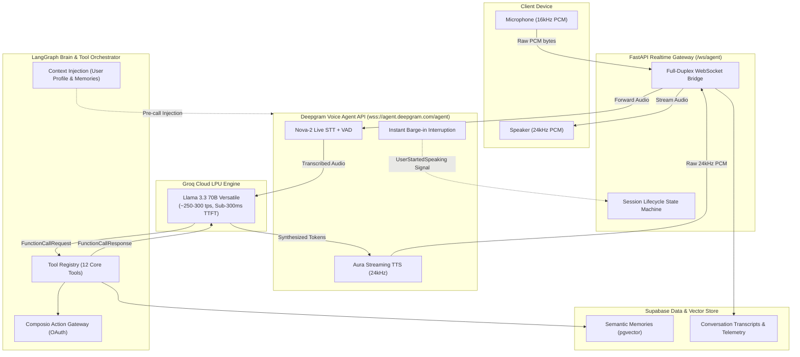
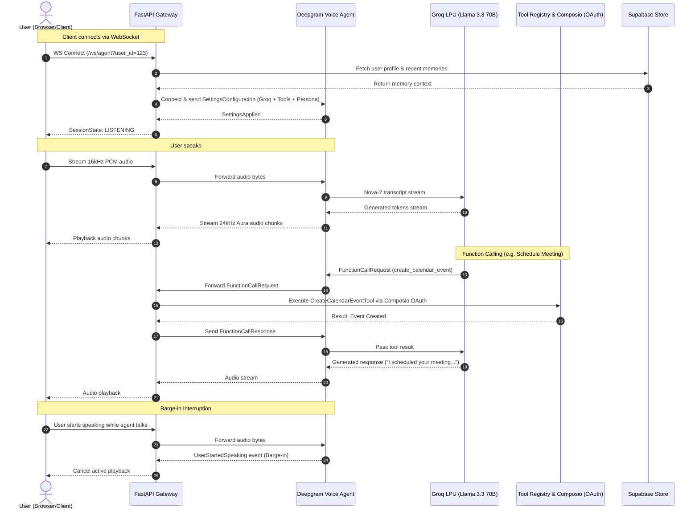

# Voice AI Agent

[](https://www.python.org/)
[](https://fastapi.tiangolo.com/)
[](https://deepgram.com/)
[](https://groq.com/)
[](https://composio.dev/)
[](https://supabase.com/)

An ultra-low-latency Voice AI Agent combining Deepgram's Voice Agent API (streaming Nova-2 STT and Aura TTS with native VAD and barge-in interruption), Groq LPU LLM Inference (llama-3.3-70b-versatile and llama-3.1-8b-instant), LangGraph Stateful Brain, Composio Tools Gateway, and Supabase Persistent Vector Memory.

---

## Architecture Overview

The system uses a Hybrid Architecture that decouples the ultra-low latency real-time voice hot path from the stateful agent reasoning and external tool execution.



---

## Key Architectural Advantages

1. Ultra-Low Latency Hot Path: Direct streaming between Deepgram's audio pipeline and Groq LPUs achieves sub-500ms Time-To-First-Audio (TTFA).
2. Native Barge-In Interruption: Deepgram detects user speech immediately and emits UserStartedSpeaking, automatically stopping agent speech without choppy audio artifacts.
3. Voice-First Prompting Constraints: Enforces plain-text rules (strictly zero markdown, emojis, asterisks, or code blocks) and natural punctuation prosody for human-like speech cadence.
4. Stateful Long-Term Memory: Automatically retrieves relevant user context before each call and stores new facts/preferences in Supabase.
5. Composio Tooling Ecosystem: External services (Gmail, Outlook, Calendar, SerpAI, Perplexity, Google Sheets, Google Docs, Google Drive) connect seamlessly through Composio OAuth without requiring separate direct API keys.

---

## Real-Time Sequence Diagram



---

## Tool Ecosystem (Composio OAuth Integrations)

The agent comes with 12 built-in tools exposed to Groq and Deepgram:

| Category | Tool Name | Description |
| :--- | :--- | :--- |
| System | `get_current_time` | Returns local date, time, and timezone in natural spoken speech. |
| Email | `send_email` | Send emails via Gmail or Outlook / Office 365. |
| Email | `search_emails` | Search recent emails by query, sender, or subject in Gmail or Outlook. |
| Calendar | `create_calendar_event` | Schedule meetings on Google Calendar or Outlook Calendar. |
| Calendar | `list_calendar_events` | List upcoming meetings and schedule availability. |
| Search | `web_search_serpapi` | Real-time live Google web search via Composio SerpAI. |
| Research | `perplexity_ai_research` | Deep online AI research and factual synthesis via Composio Perplexity. |
| Workspace | `manage_google_sheet` | Read from or append rows to Google Sheets via Composio. |
| Workspace | `manage_google_doc` | Create new documents or append text to Google Docs via Composio. |
| Workspace | `search_google_drive` | Search and locate files/documents in Google Drive via Composio. |
| Memory | `save_user_memory` | Store user preferences, facts, and recurring context into long-term memory. |
| Memory | `search_user_memory` | Search past preferences, notes, and profile details from Supabase. |

---

## Quick Start Guide

### 1. Prerequisites
- Python 3.11+
- API Keys for Deepgram, Groq (Free Tier), and Composio

### 2. Clone & Install Dependencies
```bash
# Navigate to project directory
cd VoiceAgent

# Install dependencies using pip
pip install -e voice-agent/
```

### 3. Configure Environment Variables
Copy `.env.example` and fill in your keys:
```bash
cp voice-agent/.env.example voice-agent/.env
```

```ini
# Deepgram Voice Agent API
DEEPGRAM_API_KEY=your_deepgram_api_key
DEEPGRAM_STT_MODEL=nova-2
DEEPGRAM_TTS_MODEL=aura-asteria-en

# Groq LPU Inference (Free Tier)
GROQ_API_KEY=your_groq_api_key
GROQ_MODEL=llama-3.3-70b-versatile
GROQ_FAST_MODEL=llama-3.1-8b-instant

# Composio Tool Gateway (OAuth for Gmail, Outlook, Calendar, SerpAI, Perplexity, Workspace)
COMPOSIO_API_KEY=your_composio_api_key

# Supabase Persistence
SUPABASE_URL=https://your-project.supabase.co
SUPABASE_KEY=your_supabase_key
```

### 4. Run the Application
```bash
# Start FastAPI server
uvicorn app.main:app --host 0.0.0.0 --port 8000 --app-dir voice-agent --reload
```

Server endpoints will be available at:
- REST Health Check: `http://localhost:8000/health`
- Tool Schemas: `http://localhost:8000/api/tools`
- Voice WebSocket: `ws://localhost:8000/ws/agent?user_id=your_user_id`

---

## Docker Deployment

To build and run with Docker Compose:

```bash
docker-compose -f voice-agent/docker-compose.yml up --build
```

---

## Testing

Run unit and integration test suites:

```bash
# Run pytest with PYTHONPATH configured
PYTHONPATH=voice-agent pytest voice-agent/tests/ -v
```

---

## License
MIT License. Free for open-source and commercial use.
