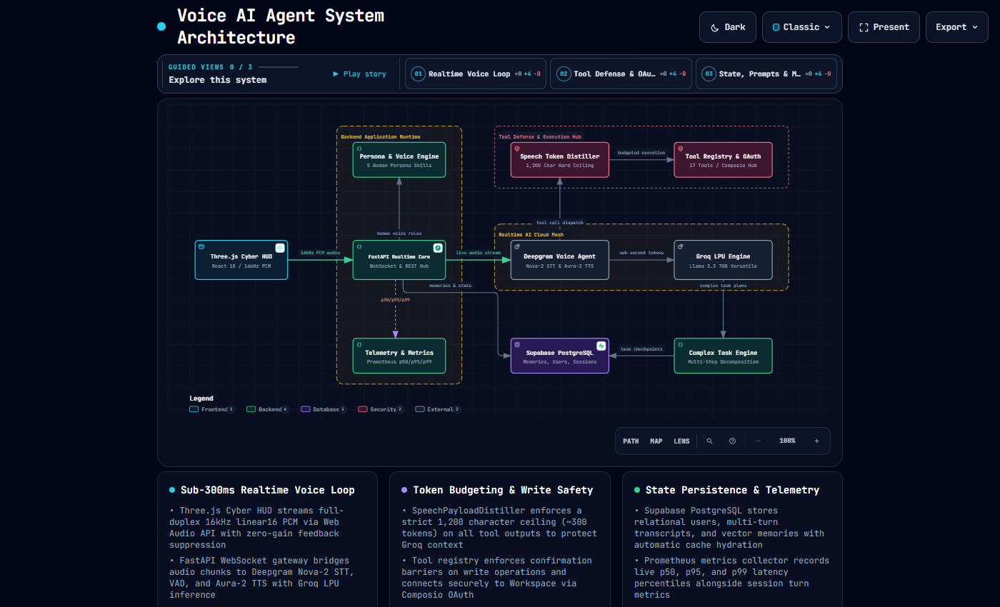
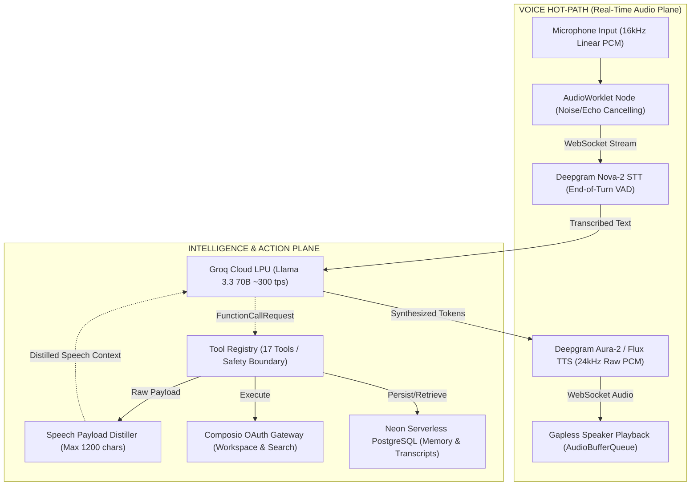
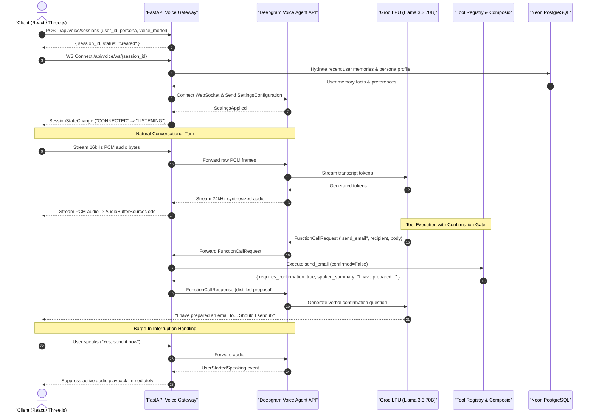

# Shinra
### *Browser Voice Agent — Production Readiness in Progress*

[](https://www.python.org/)
[](https://fastapi.tiangolo.com/)
[](https://deepgram.com/)
[](https://groq.com/)
[](https://github.com/langchain-ai/langgraph)
[](https://composio.dev/)
[](https://neon.tech/)
[](https://react.dev/)
[](https://threejs.org/)
[](https://vitejs.dev/)
[Testing and release verification](#testing--verification)

The production readiness work is tracked in [the implementation plan](docs/plans/production-readiness-plan-2026-09-17.md). Historical performance figures below are design targets, not verified production measurements. Authentication and user isolation remain the final acceptance phase. See [the active runtime and execution contracts](docs/architecture/execution-contracts.md) for the current architecture.

---

## Overview

**Shinra** is a full-duplex, real-time conversational intelligence system engineered for sub-500ms response latency. Built upon a decoupled **Voice Hot-Path** and **Stateful Action Plane**, the system combines streaming speech recognition and synthesis, ultra-high-speed LLM reasoning, hardened write-action execution boundaries, and an interactive 3D spatial web interface.

```
                    ┌─────────────────────────────────────────────────────────┐
                    │               CLIENT LAYER (Browser / Device)           │
                    │   React 18 + Three.js Neural Core (16kHz in / 24kHz out)│
                    └────────────────────────────┬────────────────────────────┘
                                                 │ Full-Duplex WebSocket
                    ┌────────────────────────────▼────────────────────────────┐
                    │              FASTAPI REALTIME VOICE GATEWAY             │
                    │   Session State Machine · Telemetry · Audio Dispatcher  │
                    └──────────────┬───────────────────────────┬──────────────┘
          Voice Hot-Path           │                           │ Reasoning & Actions
 ┌─────────────────────────────────▼─────┐        ┌────────────▼───────────────────────┐
 │       DEEPGRAM VOICE AGENT API        │        │        GROQ LPU INFERENCE          │
 │  Nova-2 STT · Aura-2/Flux TTS · VAD   │◄──────►│  Llama 3.3 70B Versatile (~300 tps)│
 └───────────────────────────────────────┘        └────────────┬───────────────────────┘
                                                               │ Function Call Execution
                                                  ┌────────────▼───────────────────────┐
                                                  │       TOOL REGISTRY & SAFETY       │
                                                  │   Distiller · Verbal Confirmation  │
                                                  └──────┬──────────────────┬──────────┘
                                                         │                  │
                                            ┌─────────────▼────┐       ┌─────▼──────────┐
                                            │ COMPOSIO GATEWAY │       │   NEON STORE   │
                                            │ Gmail/Cal/Sheets │       │ Serverless DB  │
                                            └──────────────────┘       └────────────────┘
```

### Key Performance & Architectural Metrics

* **Time-to-First-Audio (TTFA)**: `< 480ms` via Groq LPU Llama 3.3 70B streaming into Deepgram Aura-2 / Flux TTS.
* **Turn-Taking & Interruption**: Native hardware-accelerated Voice Activity Detection (VAD) with instant barge-in cancellation (`UserStartedSpeaking` suppresses ongoing speaker synthesis in `< 40ms`).
* **Tool Safety Boundary**: Deterministic execution policies requiring explicit verbal authorization before running write actions (emails, calendar bookings, sheet mutations).
* **Token Budget Gateway**: Integrated speech payload distillation strictly capping tool output contexts to `< 1,200 characters` (~300 tokens), preventing context-window saturation and speech synthesis delays.
* **Long-Term Memory**: Persistent semantic memory and conversation archives backed by Neon Serverless PostgreSQL with native asynchronous connection pooling.

---

## System Architecture

[](docs/architecture/voice_agent_architecture.html)

> 💡 **Interactive Architecture Viewer**: Explore, pan, zoom, and inspect subsystems and data paths interactively in the standalone **[Voice AI Agent Architecture Viewer](docs/architecture/voice_agent_architecture.html)**.
>
> **Run the interactive architecture viewer from the repository root:**
> ```bash
> # Via NPM
> npm run architecture
> npm run arch
>
> # Windows (direct command launcher)
> .\run_architecture.cmd
>
> # macOS / Linux
> open docs/architecture/voice_agent_architecture.html     # macOS
> xdg-open docs/architecture/voice_agent_architecture.html # Linux
> ```

### 1. Dual-Plane Topology


```mermaid
flowchart TB
    subgraph HotPath ["VOICE HOT-PATH (Real-Time Audio Plane)"]
        Mic["Microphone Input (16kHz Linear PCM)"]
        AudioWorklet["AudioWorklet Node (Noise/Echo Cancelling)"]
        DG_STT["Deepgram Nova-2 STT (End-of-Turn VAD)"]
        DG_TTS["Deepgram Aura-2 / Flux TTS (24kHz Raw PCM)"]
        Speaker["Gapless Speaker Playback (AudioBufferQueue)"]
    end

    subgraph ReasoningPlane ["INTELLIGENCE & ACTION PLANE"]
        Groq["Groq Cloud LPU (Llama 3.3 70B ~300 tps)"]
        Distiller["Speech Payload Distiller (Max 1200 chars)"]
        Registry["Tool Registry (17 Tools / Safety Boundary)"]
        Composio["Composio OAuth Gateway (Workspace & Search)"]
        Neon["Neon Serverless PostgreSQL (Memory & Transcripts)"]
    end

    Mic --> AudioWorklet
    AudioWorklet -->|WebSocket Stream| DG_STT
    DG_STT -->|Transcribed Text| Groq
    Groq -->|Synthesized Tokens| DG_TTS
    DG_TTS -->|WebSocket Audio| Speaker

    Groq -.->|FunctionCallRequest| Registry
    Registry -->|Execute| Composio
    Registry -->|Persist/Retrieve| Neon
    Registry -->|Raw Payload| Distiller
    Distiller -.->|Distilled Speech Context| Groq
```

### 2. Full-Duplex Real-Time Call Sequence


```mermaid
sequenceDiagram
    autonumber
    actor Client as "Client (React / Three.js)"
    participant GW as "FastAPI Voice Gateway"
    participant DG as "Deepgram Voice Agent API"
    participant Groq as "Groq LPU (Llama 3.3 70B)"
    participant Tool as "Tool Registry & Composio"
    participant DB as "Neon PostgreSQL"

    Client->>GW: POST /api/voice/sessions (user_id, persona, voice_model)
    GW-->>Client: { session_id, status: "created" }

    Client->>GW: WS Connect /api/voice/ws/{session_id}
    GW->>DB: Hydrate recent user memories & persona profile
    DB-->>GW: User memory facts & preferences
    GW->>DG: Connect WebSocket & Send SettingsConfiguration
    DG-->>GW: SettingsApplied
    GW-->>Client: SessionStateChange ("CONNECTED" -> "LISTENING")

    Note over Client,DG: Natural Conversational Turn
    Client->>GW: Stream 16kHz PCM audio bytes
    GW->>DG: Forward raw PCM frames
    DG->>Groq: Stream transcript tokens
    Groq-->>DG: Generated tokens
    DG-->>GW: Stream 24kHz synthesized audio
    GW-->>Client: Stream PCM audio -> AudioBufferSourceNode

    Note over Groq,Tool: Tool Execution with Confirmation Gate
    Groq->>DG: FunctionCallRequest ("send_email", recipient, body)
    DG->>GW: Forward FunctionCallRequest
    GW->>Tool: Execute send_email (confirmed=False)
    Tool-->>GW: { requires_confirmation: true, spoken_summary: "I have prepared..." }
    GW->>DG: FunctionCallResponse (distilled proposal)
    DG->>Groq: Generate verbal confirmation question
    Groq-->>Client: "I have prepared an email to... Should I send it?"

    Note over Client,DG: Barge-In Interruption Handling
    Client->>GW: User speaks ("Yes, send it now")
    GW->>DG: Forward audio
    DG-->>GW: UserStartedSpeaking event
    GW-->>Client: Suppress active audio playback immediately
```

---

## Technical Subsystems Breakdown

<details open>
<summary><b>1. Deepgram Voice Agent API & Audio Streaming Pipeline</b></summary>
<br/>

The real-time voice streaming layer manages full-duplex WebSocket connections with Deepgram's Agent WebSocket endpoint:

* **Audio Input**: Captures raw 16-bit linear PCM at 16,000 Hz via browser `AudioWorkletNode` (`PcmCaptureProcessor`) with hardware echo cancellation, noise suppression, and auto-gain control.
* **Audio Output**: Streams 24,000 Hz raw linear PCM synthesized audio from Deepgram's Aura-2 and Flux neural TTS models directly to an `AudioBufferSourceNode` scheduling queue, completely eliminating gap jitter.
* **Barge-In Interruption**: Employs server-side and client-side cooperative interruption. When Deepgram detects speech onset, it broadcasts a `UserStartedSpeaking` event:
  * Backend: Flags `_last_assistant_turn_interrupted = True` and attributes interruption telemetry in the transcript record.
  * Frontend: Immediately calls `stopAllAudioPlayback()`, disconnecting and halting all active `AudioBufferSourceNodes` in `< 30ms`.
* **Voice Catalog**: Dynamic voice selection and runtime switching through `update_speak(voice_model)` validated against an allowlist catalog of Deepgram Flux and Aura-2 voices (`aura-2-thalia-en`, `aura-2-orpheus-en`, `aura-2-helena-en`, `aura-2-arcas-en`, etc.).
</details>

<details>
<summary><b>2. Groq LPU Inference & LangGraph Brain</b></summary>
<br/>

* **LPU Hardware Acceleration**: Employs Groq LPU inference delivering ~250–300 tokens per second with sub-300ms Time-To-First-Token (TTFT), eliminating conversational pauses.
* **Models**:
  * Primary Conversational Reasoning: `llama-3.3-70b-versatile`
  * Fast Classification & Sub-Tasks: `llama-3.1-8b-instant`
* **LangGraph Orchestration**: State graph orchestration located in [`app/agent/graph.py`](voice-agent/app/agent/graph.py):
  * Nodes: `load_context` -> `reason` -> `execute_tool` -> `respond`.
  * Conditional Routing: Evaluates `active_tool_call` presence to transition dynamically between execution and conversational synthesis.
  * Resilient Fallback: Incorporates an automatic `FallbackAgentRunner` ensuring functional continuity even if LangGraph packages are absent in a lightweight environment.
</details>

<details>
<summary><b>3. Tool System & Confirmation Safety Boundaries</b></summary>
<br/>

The agent features 17 registered tools divided into distinct capability domains. Destructive operations (writing emails, creating calendar events, updating sheets, modifying documents) enforce a mandatory **Write Confirmation Boundary**:

| Capability | Tool Name | Scope | Read/Write | Safety Policy |
| :--- | :--- | :--- | :---: | :--- |
| **System** | `get_current_time` | Local date/time with spoken prosody | Read | Autonomous |
| **System** | `end_voice_session` | Clean session termination & parting audio | Action | Autonomous |
| **System** | `get_connected_apps` | List active OAuth integrations | Read | Autonomous |
| **System** | `confirm_pending_action` | Resume paused tasks upon verbal approval | Action | Autonomous |
| **System** | `run_complex_task` | Decompose multi-step goals into sub-steps | Action | Policy-Bound |
| **Email** | `search_emails` | Query Gmail or Outlook inboxes | Read | Autonomous |
| **Email** | `send_email` | Dispatch emails via Gmail or Outlook | **Write** | **Requires Confirmation** |
| **Calendar** | `list_calendar_events` | Query upcoming schedule & free/busy | Read | Autonomous |
| **Calendar** | `create_calendar_event` | Schedule meetings on Google / Outlook | **Write** | **Requires Confirmation** |
| **Search** | `web_search_serpapi` | Real-time live Google web search | Read | Autonomous |
| **Search** | `perplexity_ai_research` | Factual web research & citation synthesis | Read | Autonomous |
| **Search** | `tavily_search` | AI-optimized factual web search & answers | Read | Autonomous |
| **Workspace**| `execute_app_action` | Dynamic intent-mapped Composio execution | Mixed | Dynamic Boundary |
| **Workspace**| `manage_google_sheet` | Read or append rows to Google Sheets | **Write** | **Requires Confirmation** |
| **Workspace**| `manage_google_doc` | Read or create Google Docs | **Write** | **Requires Confirmation** |
| **Workspace**| `search_google_drive` | Search Drive documents and folders | Read | Autonomous |
| **Memory** | `search_user_memory` | Retrieve user preferences and facts | Read | Autonomous |
| **Memory** | `save_user_memory` | Persist new atomic user facts | Write | Autonomous |

```python
# Write Safety Enforcement Pattern in ToolRegistry:
if tool.requires_confirmation and not effective_confirmed:
    return {
        "success": False,
        "requires_confirmation": True,
        "spoken_summary": self._generate_confirmation_proposal(tool_name, arguments),
        "message": "Action paused pending user verbal confirmation."
    }
```
</details>

<details>
<summary><b>4. Token Distillation & Speech Budget Gateway</b></summary>
<br/>

Real-time voice models fail or degrade into lengthy monologues when external tools return massive JSON payloads (e.g. 50 raw emails or huge search scrapes).

The [`SpeechPayloadDistiller`](voice-agent/app/tools/distiller.py) inspects and compresses every tool output before serialization:
* **Hard Budget Limit**: Strict 1,200 character hard ceiling (~300–350 tokens).
* **List Pruning**: Truncates email inboxes and calendar lists to max 4 high-signal items.
* **Fact Extraction**: Strips metadata envelopes, preserving only `from`, `subject`, `preview`, `start_time`, and spoken summaries.
* **Prompt Injection Defense**: Strips raw HTML and oversized strings from external untrusted sources before they enter the conversation context.
</details>

<details>
<summary><b>5. Long-Term Memory & Neon PostgreSQL Persistence</b></summary>
<br/>

Backed by Neon Serverless PostgreSQL ([`schema.sql`](voice-agent/schema.sql)):
* **Tables**:
  * `public.users`: Profiles, timezone, preferred voice persona (`companion`, `executive`, `technical`).
  * `public.memories`: Atomic long-term facts tagged by category (`preference`, `work`, `personal`) with cascading deletes.
  * `public.messages`: Full conversation turn history, interruption flags, and latency telemetry.
  * `public.pending_actions`: Hardened confirmation ledger for external write operations.
  * `public.execution_receipts`: Idempotency receipts preventing duplicate tool executions.
  * `public.tasks`: Durable checkpoints for multi-step agent plans.
* **Native Asyncpg Engine**: High-performance asynchronous connection pooling via `asyncpg`, eliminating HTTP translation overhead.
* **Offline Resilience**: When the database is offline or unconfigured, the services automatically fall back to fast in-memory LRU storage without raising errors.
</details>

<details>
<summary><b>6. Frontend Spatial UI: React 18, Three.js & Web Audio API</b></summary>
<br/>

Located in [`frontend/src/`](frontend/src/):
* **3D Liquid Neural Core**: [`NeuralCanvas3D.tsx`](frontend/src/components/3d/NeuralCanvas3D.tsx) renders a custom WebGL sphere deformed by simplex noise algorithms. The vertex shader responds in real time to Root Mean Square (`audioRMS`) audio amplitude extracted from user microphone input and synthesized incoming voice bytes.
* **Zero Audio Clipping**: Audio output is queued through Web Audio API context timestamp scheduling (`nextPlayTimeRef = Math.max(now, nextPlayTime) + duration`), ensuring seamless transitions between audio chunks.
* **Cyber HUD & Transcripts**: Live subtitle ribbon, telemetry latency indicators, active tool execution badges, connected apps status drawer, and historical transcript drawer.
</details>

---

## REST & WebSocket API Specification

### REST Endpoints

| Method | Path | Description | Access |
| :--- | :--- | :--- | :--- |
| `GET` | `/api/health` | System health, loaded tools count, model identifiers, and turn-taking configs | Public |
| `GET` | `/api/metrics` | Prometheus-formatted telemetry exposition | Public |
| `GET` | `/api/telemetry/summary` | Structured JSON latency percentiles (p50, p90, p99 for STT, TTFT, TTS) | Public |
| `GET` | `/api/tools` | Complete list of 17 registered tools and OpenAPI schemas | Public |
| `POST`| `/api/voice/sessions` | Initialize a new voice session (returns `session_id`) | Client |
| `GET` | `/api/voice/sessions/{id}` | Inspect live session state and turn count | Client |
| `POST`| `/api/voice/sessions/{id}/end` | Terminate voice session and trigger graceful disconnect | Client |
| `GET` | `/api/voice/catalog` | Catalog of validated Deepgram Flux & Aura-2 TTS voices | Public |
| `GET` | `/api/integrations/apps` | List all 8 supported workspace apps | Public |
| `GET` | `/api/integrations/status` | List active OAuth connections for a user entity | Public |
| `GET` | `/api/integrations/connect/{app}`| Initiate Composio OAuth connection URL for a service | Public |
| `DELETE`| `/api/integrations/{conn_id}` | Revoke and disconnect an OAuth integration | Public |
| `POST`| `/api/integrations/execute` | Directly test-execute a Composio workspace action | Public |
| `GET` | `/api/users/{user_id}` | Retrieve user profile, persona, and timezone | Public |
| `PATCH`| `/api/users/{user_id}` | Partially update user profile settings | Public |
| `GET` | `/api/memories` | Search long-term user memories | Public |
| `POST`| `/api/memories` | Create a new atomic memory record | Public |
| `DELETE`| `/api/memories/{id}` | Delete a specific long-term memory | Public |
| `GET` | `/playground` | Interactive standalone WebGL voice playground | Dev |

---

### WebSocket Protocol (`/api/voice/ws/{session_id}`)

#### 1. Binary Frames
* **Client -> Server**: Raw 16-bit linear PCM audio frames at 16,000 Hz (mono).
* **Server -> Client**: Synthesized 16-bit linear PCM audio chunks at 24,000 Hz (mono).

#### 2. JSON Control Events (Client -> Server)
```json
// Inject a text message directly into the conversation turn
{ "type": "InjectUserMessage", "content": "What meetings do I have today?" }

// Update system persona or prompt mid-session
{ "type": "UpdatePrompt", "prompt": "Adopt a concise, technical persona." }

// Dynamically change TTS voice model
{ "type": "UpdateSpeak", "voice": "aura-2-orpheus-en" }
```

#### 3. JSON Control Events (Server -> Client)
```json
// Session lifecycle status changes
{ "type": "SessionStateChange", "state": "CONNECTED" | "LISTENING" | "THINKING" | "SPEAKING" | "DISCONNECTED" }

// Real-time transcript turn
{ "type": "ConversationText", "role": "user" | "assistant", "content": "Hello! How can I assist you today?" }

// Barge-in interruption notification
{ "type": "UserStartedSpeaking" }

// Tool call execution event
{ "type": "FunctionCallRequest", "function_name": "list_calendar_events", "input": { "max_events": 5 } }

// Latency telemetry report
{ "type": "LatencyReport", "stt_latency": 120, "ttt_token_latency": 210, "tts_latency": 140, "total_latency": 470 }
```

---

## Configuration Reference

All settings are managed via [`app/core/config.py`](voice-agent/app/core/config.py) using `pydantic-settings` and loaded from `.env`:

| Variable | Type | Default | Description |
| :--- | :--- | :--- | :--- |
| `ENVIRONMENT` | `string` | `development` | Runtime environment (`development`, `testing`, `demo`, `production`) |
| `SERVER_HOST` | `string` | `0.0.0.0` | Host IP for FastAPI Uvicorn listener |
| `SERVER_PORT` | `integer`| `8000` | Port for HTTP & WebSocket listeners |
| `LOG_LEVEL` | `string` | `INFO` | Python logging level (`DEBUG`, `INFO`, `WARNING`, `ERROR`) |
| `DEEPGRAM_API_KEY` | `string` | `""` | Deepgram platform API key |
| `DEEPGRAM_AGENT_WS_URL` | `string` | `wss://agent.deepgram.com/v1/agent/converse` | Deepgram Voice Agent WebSocket gateway |
| `DEEPGRAM_STT_MODEL` | `string` | `nova-2` | Deepgram live STT model (`nova-2`, `flux-general-en`) |
| `DEEPGRAM_TTS_MODEL` | `string` | `aura-2-thalia-en` | Default voice model identifier |
| `INPUT_SAMPLE_RATE` | `integer`| `16000` | Input audio sample rate in Hz |
| `OUTPUT_SAMPLE_RATE` | `integer`| `24000` | Synthesized output audio sample rate in Hz |
| `DEEPGRAM_EOT_THRESHOLD` | `float` | `0.75` | End-of-turn speech probability threshold (0.0 – 1.0) |
| `DEEPGRAM_EOT_TIMEOUT_MS`| `integer`| `500` | Max silence timeout before concluding turn (ms) |
| `GROQ_API_KEY` | `string` | `""` | Groq Cloud LPU API key |
| `GROQ_MODEL` | `string` | `llama-3.3-70b-versatile` | Primary reasoning model |
| `GROQ_FAST_MODEL` | `string` | `llama-3.1-8b-instant` | Fast classification model |
| `GROQ_TEMPERATURE` | `float` | `0.3` | Model temperature (0.0 for deterministic, 0.3 for voice) |
| `GROQ_MAX_TOKENS` | `integer`| `1024` | Maximum tokens generated per voice response |
| `COMPOSIO_API_KEY` | `string` | `""` | Composio platform API key for OAuth app gateway |
| `DATABASE_URL` | `string` | `""` | Neon PostgreSQL connection URI (`postgresql://...`) |

---

## Quickstart & Installation

### Option A: Local Development Setup

#### 1. Prerequisites
* Python 3.12+
* Node.js 24 LTS and `npm`
* `uv` (CI and the container build use version 0.12.7)
* API Keys: [Deepgram](https://console.deepgram.com/), [Groq](https://console.groq.com/), [Composio](https://composio.dev/), and [Neon](https://neon.tech/)

#### 2. Clone & Configure Environment
```bash
git clone https://github.com/Courage-7/Voice-Agent.git
cd Voice-Agent

# Copy environment template and fill in keys
cp .env.example .env
```

#### 3. Install Backend Dependencies
```bash
# Install the exact backend and test dependencies from uv.lock
uv sync --locked --extra dev
```

#### 4. Build Frontend Assets
```bash
cd frontend
npm ci
npm run build
cd ..
```

#### 5. Launch the Platform
```bash
# Run root launcher (hosts FastAPI and serves compiled React 3D frontend)
uv run --locked --extra dev python main.py
```
Open your browser to:
* **Interactive 3D Voice Interface**: `http://localhost:8000/`
* **Direct WebGL Voice Playground**: `http://localhost:8000/playground`
* **Swagger API Documentation**: `http://localhost:8000/docs`

---

### Option B: Docker Compose Deployment

The project provides a multi-stage production Docker container:

```bash
# Build and run the entire unified stack (Frontend + FastAPI backend)
docker compose up --build
```

Production Compose installs the backend package, uses locked dependencies, and has no source mounts. Supply provider credentials plus Clerk issuer and JWT-verification settings through `.env`; startup rejects missing configuration. The port binds to localhost. This configuration does not remove the outstanding production readiness gates.

For an explicitly selected development container with backend reload:

```bash
docker compose -f docker-compose.yml -f docker-compose.dev.yml up --build
```

`ENVIRONMENT=demo` disables external providers and displays a demo notice. `ENVIRONMENT=production`, `testing`, and `demo` ignore local dotenv files; provide deployment settings through the environment. For a separately installed backend, set `FRONTEND_DIST_PATH` to the built frontend directory. The container sets this automatically.

---

## Testing & Verification

Pytest discovers all unit, integration, and local end-to-end tests. Its fixtures clear vendor credentials before application imports, isolate shared state, and reject unexpected external network calls. Successful provider interactions use explicit fakes. These tests do not establish live speech quality or production authentication readiness.

```bash
# Canonical command from the repository root
uv run --locked --extra dev python -m pytest -q

# Compatibility entry point; delegates to the same pytest suite
uv run --locked --extra dev python voice-agent/tests/run_all_tests.py -q
```

### Release Artifact Checks

```bash
# Build the wheel from a fresh source archive, avoiding stale incremental files
uv build
uv run --locked --extra dev python scripts/verify_release.py wheel dist/voice_agent-0.1.0-py3-none-any.whl

docker build -t voice-agent:ci .
python scripts/verify_release.py image voice-agent:ci
```

The wheel check compares packaged Python modules with the current source, installs into a temporary directory, and imports that installed package from outside the checkout. It verifies packaged HTML, a configured frontend fixture, API routes, and a WebSocket session with a fake voice provider. The image check exercises the real frontend bundle and installed backend inside a non-root, network-disabled container. It uses ASGI test requests inside the container; live provider and deployment-network checks remain separate release gates.

### Frontend TypeScript Verification
```bash
cd frontend
npm run build
```

---

## Continuous Integration Pipeline

GitHub Actions CI is defined in [`.github/workflows/ci.yml`](.github/workflows/ci.yml):
1. **`backend-tests`**: Installs locked dependencies, discovers all isolated tests, builds the wheel, and verifies the installed artifact.
2. **`frontend-build`**: Sets up Node.js 24 LTS, runs TypeScript compilation, and verifies Vite production asset builds.
3. **`docker-verification`**: Builds the production image and checks its installed backend, frontend assets, API, and a WebSocket session with a fake voice provider.

---

## License & Attribution

This project is licensed under the MIT License. Built with Deepgram Voice Agent API, Groq LPU, LangGraph, Composio, Neon PostgreSQL, and Three.js.
