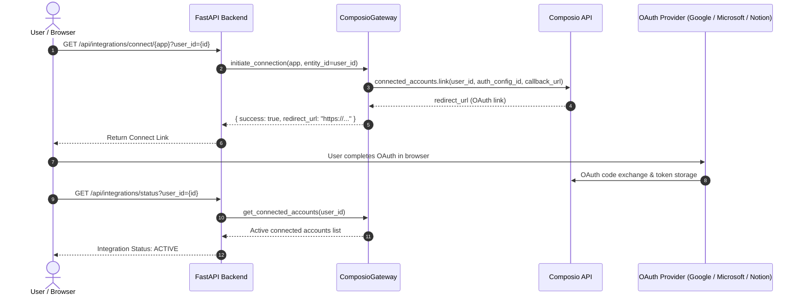

# Composio Workspace Integrations & Composite Skills

Comprehensive architectural reference for Composio tool execution, user-scoped OAuth 2.0 connections, atomic tool execution, dynamic tool hydration, and tool-level multi-app composite skills in **Shinra**.

---

## 1. Architectural Role & Philosophy

In Shinra, **Composio** is not a static OAuth link manager. It acts as an active **Tool Execution and Skills Gateway** (`ComposioGateway`) that bridges the conversational intelligence plane (Deepgram Voice Agent API + Groq LPU) with real-world enterprise applications.

```
┌────────────────────────────────────────────────────────────────────────┐
│                   CONVERSATIONAL INTELLIGENCE PLANE                    │
│     Deepgram Live STT ──► Groq LPU (Llama 3.3 70B) ──► Deepgram TTS    │
└───────────────────────────────────┬────────────────────────────────────┘
                                    │ FunctionCallRequest
                                    ▼
┌────────────────────────────────────────────────────────────────────────┐
│                   TOOL REGISTRY & SAFETY BOUNDARIES                    │
│   Token Distiller (<1200 char) · Write Confirmation · 10s Deduplication│
└───────────────────────────────────┬────────────────────────────────────┘
                                    │ User Session Scoped Execution
                                    ▼
┌────────────────────────────────────────────────────────────────────────┐
│                        COMPOSIO GATEWAY CORE                           │
│     Entity-Scoped Sessions · Auth Config Catalog · Connect Links       │
└───────┬───────────────────────────┬────────────────────────────┬───────┘
        │                           │                            │
        ▼                           ▼                            ▼
┌──────────────────┐       ┌──────────────────┐         ┌────────────────┐
│  COMMUNICATION   │       │   PRODUCTIVITY   │         │ SEARCH & DB    │
│  Gmail, Outlook, │       │  Google Docs,    │         │ SerpApi,       │
│  Teams, WhatsApp,│       │  Sheets, Drive,  │         │ Perplexity,    │
│  Telegram,       │       │  Calendar,       │         │ Tavily, Neon,  │
│  LinkedIn        │       │  Notion, iLovePDF│         │ Vapi           │
└──────────────────┘       └──────────────────┘         └────────────────┘
```

### Key Invariants
1. **User Identity Isolation**: Every session, connection link, and action execution is tied strictly to the authenticated `user_id` (Clerk JWT / DB UUID). Cross-tenant execution is architecturally impossible.
2. **Deterministic Write Confirmation**: Read actions execute autonomously; write actions (sending emails, modifying spreadsheets, creating calendar events, posting chat messages) enforce a server-side verbal confirmation barrier.
3. **Speech Token Budgeting**: All raw Composio JSON payloads are intercepted by [`SpeechPayloadDistiller`](../../voice-agent/app/tools/distiller.py), stripping raw HTML and pruning lists to max 4 high-signal records under a strict 1,200 character ceiling (~300 tokens).
4. **Dynamic Tool Hydration**: Connected apps dynamically hydrate into Deepgram / Groq function-calling schemas at session launch without semantic clutter or model competition.

---

## 2. Supported Apps Matrix (17 Integrations)

The platform supports 17 baseline integrations configured within the project catalog:

| App Name | Slug | Category | Key Actions (`INTENT_SLUG_MAP`) | Auth Scheme | Safety Boundary |
| :--- | :--- | :--- | :--- | :--- | :---: |
| **Gmail** | `gmail` | Communication | `GMAIL_FETCH_EMAILS`, `GMAIL_SEND_EMAIL`, `GMAIL_CREATE_DRAFT` | OAuth 2.0 | Read: Auto / Write: Verbal Confirm |
| **Google Calendar** | `googlecalendar` | Productivity | `GOOGLECALENDAR_FIND_EVENT`, `GOOGLECALENDAR_CREATE_EVENT`, `GOOGLECALENDAR_FIND_FREE_SLOTS` | OAuth 2.0 | Read: Auto / Write: Verbal Confirm |
| **Google Docs** | `googledocs` | Productivity | `GOOGLEDOCS_CREATE_DOCUMENT`, `GOOGLEDOCS_GET_DOCUMENT` | OAuth 2.0 | Read: Auto / Write: Verbal Confirm |
| **Google Sheets** | `googlesheets` | Productivity | `GOOGLESHEETS_BATCH_GET`, `GOOGLESHEETS_APPEND_VALUES`, `GOOGLESHEETS_UPDATE_VALUES` | OAuth 2.0 | Read: Auto / Write: Verbal Confirm |
| **Google Drive** | `googledrive` | Productivity | `GOOGLEDRIVE_SEARCH_FILES`, `GOOGLEDRIVE_GET_FILE` | OAuth 2.0 | Read: Auto / Write: Verbal Confirm |
| **Microsoft Outlook 365** | `outlook` | Communication | `OUTLOOK_GET_EMAILS`, `OUTLOOK_SEND_MAIL`, `OUTLOOK_GET_CALENDAR_VIEW` | OAuth 2.0 | Read: Auto / Write: Verbal Confirm |
| **Notion** | `notion` | Productivity | `NOTION_SEARCH_NOTION_PAGE`, `NOTION_CREATE_NOTION_PAGE`, `NOTION_GET_PAGE_OR_DATABASE` | OAuth 2.0 | Read: Auto / Write: Verbal Confirm |
| **Microsoft Teams** | `microsoft_teams` | Communication | `MICROSOFT_TEAMS_LIST_CHATS`, `MICROSOFT_TEAMS_SEND_CHAT_MESSAGE` | OAuth 2.0 | Read: Auto / Write: Verbal Confirm |
| **WhatsApp** | `whatsapp` | Communication | `WHATSAPP_SEND_MESSAGE` | API Key / OAuth | Read: Auto / Write: Verbal Confirm |
| **Telegram** | `telegram` | Communication | `TELEGRAM_SEND_MESSAGE` | Bot Token | Read: Auto / Write: Verbal Confirm |
| **LinkedIn** | `linkedin` | Communication | `LINKEDIN_GET_MY_PROFILE`, `LINKEDIN_CREATE_POST` | OAuth 2.0 | Read: Auto / Write: Verbal Confirm |
| **SerpApi (Google)** | `serpapi` | Search | `SERPAPI_SEARCH` | API Key | Autonomous |
| **Perplexity AI** | `perplexityai` | Search | `PERPLEXITYAI_PERPLEXITY_AI_SEARCH` | API Key | Autonomous |
| **Tavily Search** | `tavily` | Search | `TAVILY_SEARCH`, `TAVILY_CRAWL`, `TAVILY_EXTRACT` | API Key | Autonomous |
| **Neon PostgreSQL** | `neon` | Database | `NEON_LIST_PROJECTS`, `NEON_GET_PROJECT` | API Key / OAuth | Autonomous |
| **iLovePDF** | `i_love_pdf` | Productivity | `I_LOVE_PDF_PROCESS_PDF` | API Key | Read: Auto / Write: Verbal Confirm |
| **Vapi Voice AI** | `vapi` | Developer | Telephony and phone agent dispatch | API Key | Policy-Bound |

---

## 3. Tool-Level Skills vs. Atomic Actions

Shinra distinguishes between **Atomic Tools** (single targeted actions) and **Tool-Level Skills** (orchestrated multi-step workflows).

```
                        ┌───────────────────────────────┐
                        │       USER VOICE INTENT       │
                        └───────────────┬───────────────┘
                                        │
                 Is it a multi-app / multi-step workflow?
                                 /             \
                             YES                 NO
                             /                     \
             ┌─────────────────────────┐   ┌─────────────────────────┐
             │    TOOL-LEVEL SKILL     │   │      ATOMIC ACTION      │
             │   (run_complex_task)    │   │ (search_emails, etc.)   │
             └────────────┬────────────┘   └────────────┬────────────┘
                          │                             │
             ┌────────────▼────────────┐   ┌────────────▼────────────┐
             │   ComplexTaskPlanner    │   │  Direct Provider Call   │
             │ Decomposes into ordered │   │  Single Tool Execution  │
             │   steps with ledger     │   │     via ToolRegistry    │
             └─────────────────────────┘   └─────────────────────────┘
```

### Supported Composite Skills

Shinra includes 6 native composite skills resolved dynamically in [`ComposioGateway.resolve_skill_steps()`](../../voice-agent/app/integrations/composio/client.py):

#### Skill 1: Research & Document Compilation
* **Trigger**: *"Research quantum computing algorithms and save the findings into a Google Doc."*
* **Step 1**: Search the web via Perplexity AI (`perplexity_ai_research`) or Tavily / SerpApi.
* **Step 2**: Compile and format findings into a structured Google Doc (`manage_google_doc`).
* **Confirmation Gate**: Pauses on Step 2 to obtain verbal approval for document creation.

#### Skill 2: Inbox Triage & Spreadsheet Logging
* **Trigger**: *"Check my unread emails from clients and log them into my spreadsheet."*
* **Step 1**: Query inbox for unread messages via `search_emails`.
* **Step 2**: Extract sender, subject, and date; append rows via `manage_google_sheet`.
* **Confirmation Gate**: Pauses on Step 2 to confirm spreadsheet append.

#### Skill 3: Calendar Availability Check & Scheduling
* **Trigger**: *"Check my calendar for open slots tomorrow and schedule a sync with Alex."*
* **Step 1**: Inspect upcoming calendar availability via `list_calendar_events`.
* **Step 2**: Propose available slot and schedule meeting via `create_calendar_event`.
* **Confirmation Gate**: Pauses on Step 2 to verify event time and attendees.

#### Skill 4: Research & Notes Capture into Notion
* **Trigger**: *"Look up the latest AI voice latency benchmarks and create a notes page in Notion."*
* **Step 1**: Retrieve benchmarks via `web_search_serpapi` or `perplexity_ai_research`.
* **Step 2**: Format markdown and invoke `execute_app_action` (`app_name="notion"`, `intent="create"`).
* **Confirmation Gate**: Pauses before page creation for verbal approval.

#### Skill 5: Multi-Platform Messaging & Notification Dispatch
* **Trigger**: *"Send a message on Teams to let the team know the release build passed."*
* **Step 1**: Compose message payload.
* **Step 2**: Invoke `execute_app_action` (`app_name="microsoft_teams"`, `intent="send"`).
* **Confirmation Gate**: Pauses before message transmission to read back text and recipient.

#### Skill 6: Drive Document Search & Synthesis
* **Trigger**: *"Find my quarterly financial model in Google Drive and summarize the key figures."*
* **Step 1**: Search Google Drive metadata and files via `search_google_drive`.
* **Step 2**: Extract and summarize findings for voice readout.

---

## 4. Dynamic Tool Hydration & Schema Generation

To minimize token usage and prevent semantic competition, tools are filtered and hydrated dynamically:

1. **Static Tool Baseline**: Core tools (`get_current_time`, `end_voice_session`, `search_user_memory`, `save_user_memory`, `run_complex_task`) are always available.
2. **Provider Disambiguation**: When both Gmail and Outlook are connected, [`CapabilityResolver`](../../voice-agent/app/tools/capability.py) prompts the user verbally (*"You have both Gmail and Outlook connected. Which would you like me to use?"*).
3. **Dynamic-Only App Hydration**: When the user connects an app that relies on dynamic execution (such as `NOTION`, `MICROSOFT_TEAMS`, `WHATSAPP`, `TELEGRAM`, `LINKEDIN`, or `NEON`), [`ToolRegistry.get_deepgram_function_schemas()`](../../voice-agent/app/tools/registry.py) automatically exposes `execute_app_action`. When only Google Workspace or Search tools are connected, `execute_app_action` is omitted to eliminate semantic confusion.

---

## 5. User-Scoped OAuth 2.0 Connection Flow

Every integration connection uses Composio's **Connect Link** pattern:



### Connection State Invalidation
Connection state is a security precondition. When an account is connected or disconnected, the backend immediately calls `composio_gateway.invalidate_connected_accounts(entity_id)`, busting the 60-second read cache so the newly connected tool is usable immediately without restart.

---

## 6. Write Confirmation & Safety Ledger

### Confirmation Flow
```
User: "Send an email to Bob saying the meeting is pushed to 3 PM."
  ▼
Model: FunctionCallRequest: send_email(recipient="bob@example.com", body="Meeting is pushed to 3 PM")
  ▼
ToolRegistry: Detects requires_confirmation = True, confirmed = False
  ▼
PendingActionStore: Records action with 5-minute TTL and unique action_id
  ▼
Model Spoken Prompt: "I have prepared an email to Bob saying the meeting is pushed to 3 PM. Should I send it now?"
  ▼
User: "Yes, send it."
  ▼
Model: FunctionCallRequest: confirm_pending_action(action_id="...", confirmed=True)
  ▼
ToolRegistry: Consumes pending action, executes send_email through ComposioGateway
  ▼
ExecutionLedger: Records execution receipt (10s deduplication window)
  ▼
Model Spoken Output: "Email sent successfully."
```

---

## 7. Verbal Turn-Holding & Zero Dead Air

Voice interactions cannot tolerate 2-4 seconds of silent latency while external APIs execute.

Shinra implements **Zero-Dead-Air Pipelining**:
1. When user speech ends, [`get_contextual_verbal_filler()`](../../voice-agent/app/agent/verbal_feedback.py) generates a context-aware verbal filler in $< 5\text{ ms}$:
   - Email: *"Looking through your inbox right now..."*
   - Calendar: *"Checking your calendar for tomorrow..."*
   - Search: *"Looking that up for you right now..."*
   - Notion: *"Checking your Notion workspace..."*
   - Composite Task: *"On it, gathering that information and preparing the details..."*
2. The filler is concurrently dispatched to Deepgram TTS while Composio executes the tool in the background.
3. The spoken response streams gaplessly as soon as tool results arrive, completely eliminating awkward silence.

---

## 8. How to Add a New Composio Integration

To add a new integration to Shinra:

1. **Add App Metadata**: Add the app definition to `BASELINE_PROJECT_APPS` in [`app/integrations/composio/client.py`](../../voice-agent/app/integrations/composio/client.py).
2. **Define Intent Mappings**: Add common user intents to `INTENT_SLUG_MAP` in [`app/tools/workspace/dynamic_action.py`](../../voice-agent/app/tools/workspace/dynamic_action.py).
3. **Register Composite Skill**: If the app supports multi-step workflows, add intent detection and step resolution in `resolve_skill_steps()` in [`app/integrations/composio/client.py`](../../voice-agent/app/integrations/composio/client.py) and fallback heuristics in [`app/agent/complex_tasks/planner.py`](../../voice-agent/app/agent/complex_tasks/planner.py).
4. **Add Verbal Fillers**: Add conversational turn-holding phrases in [`app/agent/verbal_feedback.py`](../../voice-agent/app/agent/verbal_feedback.py).
5. **Verify with Pytest**: Add unit tests in [`tests/unit/test_composio_skills_planner.py`](../../voice-agent/tests/unit/test_composio_skills_planner.py).
