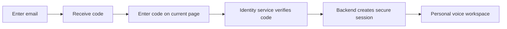

# VoiceAgent production readiness implementation plan

Created 17 September 2026. Updated 18 September 2026. **Status: Phase 1 implemented and locally verified; Phases 2–7 remain open.**

The repository was checked before implementation. It already contained partial action approval, persistence, connector, voice, and login work; those changes do not yet satisfy the corresponding completion gates. See the [Phase 1 evidence and remaining gaps](C:/Users/coura/OneDrive/Desktop/VoiceAgent/docs/reports/phase1-foundation-2026-09-18.md). The current database adapter uses Neon/PostgreSQL; the original Supabase-specific authentication proposal must be reconsidered when Phase 7 begins.

Based on the [production readiness audit](C:/Users/coura/OneDrive/Desktop/VoiceAgent/docs/reports/production_readiness_audit_2026-09-17.md), which assessed the current working tree at **40/100**. Finding references below correspond to that report.

**Objective:** ship a browser voice assistant that carries out a small set of useful tasks correctly, recovers predictably, protects each user's information, and provides measurable evidence of readiness.

**Authentication is the final implementation phase, as requested.** Earlier phases define ownership fields and internal interfaces so that authentication can be connected cleanly later. They do not introduce the production login flow. Keep the application local or access-restricted until Phase 7 passes; completing the earlier phases does not resolve the audit's critical access-control finding.

## Delivery sequence

| Phase | Deliverable | Completion gate | Audit coverage |
|---|---|---|---|
| 1 | Repeatable builds and a trustworthy test baseline | A clean checkout produces the real application and runs the complete isolated suite | F03, F13, F14 |
| 2 | Truthful, safely approved tool execution | Failed actions cannot become success; forged or replayed approvals cannot trigger writes | F02, F04, F06; direct-action bypass in F01 |
| 3 | Durable conversations, memory, and task state | Acknowledged changes and pending tasks survive restart; failed saves are reported | F10, F15 |
| 4 | Working connectors and complete workflows | Supported tasks use real prior results and produce verified artifacts | F05, F07, F12, F13 |
| 5 | Reliable live voice and resource cleanup | Interruption remains responsive during slow work; every stop releases resources | F08, F09, F12 |
| 6 | Measured quality and operational readiness | Release artifact passes realistic voice, failure, load, and recovery checks | F11, F14, F15; verification of Phases 1–5 |
| **7 — last** | **Email OTP authentication and complete user isolation** | **Two users cannot access or act through each other's resources; the complete signed-in journey passes** | **F01, plus identity binding across F02, F07, F10, F15** |

Complete the gate for each phase before relying on it in the next. Add regression tests alongside each fix; Phase 6 brings those checks together and adds realistic system testing.

## Scope and architecture decisions

- Retain React, FastAPI, Deepgram, the current Neon/PostgreSQL persistence adapter, and the existing voice/tool provider adapters. Preserve the common tool registry and AudioWorklet/playback foundations. The database migration was already present when the foundation work resumed.
- Keep one modular backend. Use the current Deepgram voice path with explicit supported workflows. Remove or quarantine the incomplete alternative LangGraph path unless a demonstrated requirement justifies finishing it.
- Prove four initial capabilities: email search, an explicitly confirmed email send, calendar availability lookup, and research that produces a genuinely populated document. Other capabilities remain unavailable until verified.
- Define an internal actor/owner contract now. Domain services receive an owner from server context, not arbitrary tool arguments. Before Phase 7, local development and tests use a fixed server-controlled development identity. This is scaffolding, not authentication or permission to expose the service.
- Separate structured execution state from the short text spoken to the user. A spoken summary must never be the only record of what happened.

## Phase 1 — Establish a repeatable foundation

**Outcome:** developers and CI can reproduce failures and build exactly what will run.

- [x] Make full pytest discovery the canonical backend test entry point. Repair the four observed failures by correcting fixtures or expectations where warranted; retain meaningful assertions.
- [x] Explicitly inject fake providers in ordinary tests and block unexpected external calls. Keep live provider checks in a separately configured suite.
- [x] Use frozen dependency locks in CI and images. Remove the frontend fallback from a frozen install to a mutable install.
- [x] Fix Python package discovery so an installed wheel contains and imports the backend.
- [x] Exclude environment files, virtual environments, local dependencies, caches, and Git data from Docker context. Separate development source mounts from production configuration.
- [x] Validate required production configuration and make simulation an explicit, visibly labelled mode.
- [x] Record the actual orchestration path and define shared result, workflow, owner, and connection-state contracts before changing their implementations.

**Gate passed locally, 18 September 2026:** locked installation; 101 isolated tests; the compatibility runner discovers all 101 tests; TypeScript/Vite build under Node 24; a freshly installed wheel; and the built container serving its frontend, API, and a fake-provider WebSocket session. Docker was available for this implementation run. CI is configured but has not been run remotely. Live-provider, real-device, database recovery, and final authentication checks remain in later phases. [Verification details](C:/Users/coura/OneDrive/Desktop/VoiceAgent/docs/reports/phase1-foundation-2026-09-18.md).

Starting points: [CI](C:/Users/coura/OneDrive/Desktop/VoiceAgent/.github/workflows/ci.yml), [root manifest](C:/Users/coura/OneDrive/Desktop/VoiceAgent/pyproject.toml), [Dockerfile](C:/Users/coura/OneDrive/Desktop/VoiceAgent/Dockerfile), [test runner](C:/Users/coura/OneDrive/Desktop/VoiceAgent/voice-agent/tests/run_all_tests.py).

## Phase 2 — Make actions trustworthy

**Outcome:** the agent can explain what happened accurately, and an external write requires the intended approval.

- [ ] Normalize provider outcomes into explicit states such as succeeded, failed, needs-confirmation, needs-clarification, cancelled, and uncertain. Missing configuration must produce unavailable, never fabricated accounts or success.
- [ ] Route all actions through the common policy gateway. Remove or disable unrestricted direct execution. Apply policy to the resolved operation, including dynamically selected tools.
- [ ] Create a pending-action record with action ID, owner context, session, resolved operation, validated arguments, argument hash, expiry, and execution state.
- [ ] Bind approval to that exact record. Ignore model-supplied confirmation booleans as authorization. Reject changed arguments, expired records, reused approvals, and mismatched sessions.
- [ ] For the initial release, require confirmation for external writes. Read back essential details; use a visible confirmation control where reliable voice confirmation cannot be established. A voice approval must be attributable to an actual user turn addressing the pending action; ambiguous speech asks again.
- [ ] Enforce tool deadlines and bounded concurrency. Record request IDs and provider receipts. Use provider idempotency where supported; otherwise stop and reconcile an uncertain write instead of retrying blindly.
- [ ] Preserve task IDs, message/thread IDs, status, and continuation handles in structured results. Apply speech-size limits consistently, including non-ASCII output and confirmation branches.

Use a repository interface for pending actions and the execution ledger here; Phase 3 supplies durable storage. The server-controlled development actor is replaced by verified identity in Phase 7.

**Gate:** fake-provider tests cover `successful: false`, malformed output, authorization errors, rate limits, timeouts, and unknown completion. Forged, ambiguous, modified, expired, and replayed confirmations produce zero provider writes in the tested scenarios. Repeated requests reuse the recorded outcome rather than resending an action.

Starting points: [tool registry](C:/Users/coura/OneDrive/Desktop/VoiceAgent/voice-agent/app/tools/registry.py), [Composio adapter](C:/Users/coura/OneDrive/Desktop/VoiceAgent/voice-agent/app/integrations/composio/client.py), [distiller](C:/Users/coura/OneDrive/Desktop/VoiceAgent/voice-agent/app/tools/distiller.py).

## Phase 3 — Make saved state reliable

**Outcome:** history, memory, approvals, and task progress remain correct after failures and restarts.

- [ ] Make the database authoritative. Report failed persistence; do not acknowledge a save or deletion solely because an in-process cache changed.
- [ ] Persist original timestamps, transcript metadata, task checkpoints, pending approvals, and execution receipts. Add migrations, indexes, bounded pagination, and transactional updates where state changes must be atomic.
- [ ] Load history from storage on a fresh process. Remove assumptions that a profile or memory must first have been loaded into a local dictionary.
- [ ] Bound caches and expired-session cleanup. Ensure multiple workers see consistent workflow state and only one worker can claim a write for execution.
- [ ] Add owner fields consistently across conversations, memory, tasks, approvals, and connection mappings. Actual authenticated ownership enforcement and the final identity migration remain in Phase 7.
- [ ] Preserve memory source, time, and confidence; support correction and forgetting. Treat retrieved memory and external documents as untrusted content.
- [ ] Define configurable transcript/memory retention and deletion behavior, including backup expiry. Redact message bodies, private facts, credentials, and tool parameters from operational logs.

**Gate:** save, restart, and read back the same state; delete, restart, and confirm deletion. Simulate a database outage and verify honest failure reporting. Resume a pending task after restart and worker change without losing approval state or duplicating a write. Check that logs contain identifiers and outcomes without sensitive payloads.

Starting points: [conversation service](C:/Users/coura/OneDrive/Desktop/VoiceAgent/voice-agent/app/conversations/service.py), [memory service](C:/Users/coura/OneDrive/Desktop/VoiceAgent/voice-agent/app/memory/service.py), [schema](C:/Users/coura/OneDrive/Desktop/VoiceAgent/voice-agent/schema.sql).

## Phase 4 — Finish connectors and supported workflows

**Outcome:** the visible product capabilities work from request to verified result.

- [ ] Align the frontend/backend OAuth URL contract. Track pending, active, failed, expired, and revoked connections; only verified active connections are usable.
- [ ] Validate connection completion with the provider. A callback or an existing account record alone must not imply success.
- [ ] Replace placeholder recipients, document content, destinations, and times with validated user input or prior-step results. Resolve timezone and ambiguous names explicitly.
- [ ] Make clarification and confirmation actual pause states. Persist the task handle and resume the correct step; stop downstream writes when prerequisites fail.
- [ ] Finish the four scoped workflows and verify resulting content or provider receipts. Make unsupported requests explicit.
- [ ] Wire persona, voice selection, and history resume to real behavior. Clearly label settings that apply only to the next session.
- [ ] Remove inactive orchestration code or test its bounded execution before exposing it.

**Gate:** in controlled test accounts, research results appear in the created document; email search retains usable identifiers; the approved send uses the intended account, recipient, and content; calendar results reflect the selected timezone. Denial, revoked credentials, multiple connected providers, missing details, and interruption all produce the correct state.

These checks establish connector behavior. Binding OAuth initiation, completion, execution, and disconnect to the authenticated account is part of Phase 7.

Starting points: [workflow engine](C:/Users/coura/OneDrive/Desktop/VoiceAgent/voice-agent/app/agent/complex_tasks/engine.py), [planner](C:/Users/coura/OneDrive/Desktop/VoiceAgent/voice-agent/app/agent/complex_tasks/planner.py), [connector hook](C:/Users/coura/OneDrive/Desktop/VoiceAgent/frontend/src/hooks/useConnectors.ts), [application controls](C:/Users/coura/OneDrive/Desktop/VoiceAgent/frontend/src/App.tsx).

## Phase 5 — Harden the live voice experience

**Outcome:** calls stay responsive while tools run and end cleanly under every exit path.

- [ ] Keep provider event reading independent of slow tool execution and persistence. Use tracked workers, bounded queues, deadlines, and ordered outbound events.
- [ ] Define a session state machine covering connecting, listening, speaking, interrupted, reconnecting, stopping, and closed. Reject duplicate starts and obsolete asynchronous callbacks.
- [ ] Handle microphone denial and stop-during-permission races. On stop or unmount, release tracks, AudioContexts, playback nodes, sockets, timers, and background tasks.
- [ ] Propagate provider errors and disconnects to the UI. Close both WebSocket legs consistently; drain active sessions during deployment.
- [ ] Distinguish stopping speech from cancelling work. Cancelling a local task does not prove an external send was undone. Reconnection must not silently replay writes.
- [ ] Validate speech model settings and negotiate audio formats/sample rates. Test actual provider message contracts for the pinned versions.

**Gate:** interruption remains responsive during a deliberately slow tool. Permission denial, double start, tab closure, server hangup, upstream loss, and repeated connect/stop cycles leave no orphan microphone activity or session tasks. Validate on real devices and the supported browsers, including speaker echo and headphones.

Starting points: [Deepgram session](C:/Users/coura/OneDrive/Desktop/VoiceAgent/voice-agent/app/integrations/deepgram/agent_session.py), [realtime session](C:/Users/coura/OneDrive/Desktop/VoiceAgent/voice-agent/app/realtime/session.py), [voice hook](C:/Users/coura/OneDrive/Desktop/VoiceAgent/frontend/src/hooks/useVoiceAgent.ts).

## Phase 6 — Establish measurable release quality

**Outcome:** reliability claims are backed by tests, measurements, and operational procedures.

- [ ] Normalize latency units and frontend event contracts. Correlate session, turn, tool, approval, and provider receipt without logging private content.
- [ ] Separate liveness from readiness. Required missing configuration and unavailable critical dependencies must affect readiness appropriately.
- [ ] Measure utterance-end to first audible response, interruption cutoff, tool duration, failed turns, unexpected disconnects, queue depth, and cost per session.
- [ ] Set maximum call duration, queue sizes, concurrent sessions, tool/turn budgets, and spend limits. Prepare per-user quota interfaces; bind them to verified users in Phase 7.
- [ ] Add recorded speech evaluations for accents, noise, overlapping speech, pauses, names, numbers, dates, corrections, and malicious instructions embedded in retrieved content.
- [ ] Test peak expected concurrency plus agreed headroom, long calls, slow clients, provider outages, throttling, database recovery, and deployment drain.
- [ ] Run dependency and secret scans, a clean-image smoke test, migration rehearsal, backup restore, rollback exercise, and alert delivery checks. Document recovery ownership and procedures.

**Initial measurement targets:** p95 below 1.2 seconds for simple no-tool response onset and below 250 ms for interruption cutoff on the agreed device/network matrix. These are provisional product targets, not current results or provider guarantees. Report tool-heavy turns separately. Set the actual concurrency and cost budgets from the intended launch size before load testing.

**Gate:** retain a release evidence report with tested versions, environment, workload, results, and limitations. Critical failures must be resolved or the affected capability disabled. Authentication and cross-user checks are explicitly outstanding until Phase 7; this phase does not authorize public launch.

Starting points: [latency metrics](C:/Users/coura/OneDrive/Desktop/VoiceAgent/voice-agent/app/observability/latency.py), [metrics service](C:/Users/coura/OneDrive/Desktop/VoiceAgent/voice-agent/app/observability/metrics.py), [audit acceptance matrix](C:/Users/coura/OneDrive/Desktop/VoiceAgent/docs/reports/production_readiness_audit_2026-09-17.md).

## Phase 7 — Authentication and user isolation — final implementation phase

### Recommended sign-in experience

**Use email OTP for the first release, with authentication implemented last.** Keep magic links as an optional later convenience. The original plan proposed Supabase Auth when the repository used Supabase. The current repository uses Neon/PostgreSQL and a provisional custom OTP service. Choose and verify a maintained OTP provider at the start of this final phase; the database migration alone does not establish a production authentication service. Keep identity verification behind the backend interface below so that the provider decision does not block Phases 1–6.

| Option | Experience | Recommendation for this product |
|---|---|---|
| Email OTP | Enter email, receive a six-digit code, enter or paste it into the current page | First release: users remain on the voice-agent page and can read email on another device |
| Magic link | Enter email, open the link, return through a login callback | Optional: fewer keystrokes, with additional redirect and browser/device handling to test |

Supabase Auth remains one possible provider: its `signInWithOtp` flow sends a magic link by default; an email template using `{{ .Token }}` and OTP verification with type `email` provides a code flow. This is an integration option, not a description of the current Neon-backed implementation. [Passwordless email documentation](https://supabase.com/docs/guides/auth/auth-email-passwordless).

Use one sign-in/sign-up experience: a first verified login creates a profile; a returning login opens the existing profile. Create the profile idempotently from the verified user ID. If the initial launch is invitation-only, enforce that rule before account creation and workspace admission.

Login identifies the person using this application. Connecting Gmail, Outlook, or another service still requires that service's OAuth consent. An authenticated session also does not replace confirmation of an individual send or other write.

### Implementation work

- [ ] **Provider, email delivery, and login screen.** Select the managed OTP service and production email delivery integration. Configure a verified sending domain and a short branded code email, including SPF, DKIM, and DMARC with the chosen mail service. Prove actual delivery and honest failure reporting before acknowledging a sent code. If Supabase Auth is selected, configure custom SMTP rather than relying on its testing sender. [Supabase SMTP documentation](https://supabase.com/docs/guides/auth/auth-smtp).
- [ ] **Request and verification endpoints.** Add backend operations for requesting a code, verifying it, reading the current session, and signing out. Bind a short-lived challenge to the email and initiating browser. Provide paste/autofill, resend countdown, change-email, and clear invalid/expired-code handling. Avoid disclosing whether an account exists.
- [ ] **Abuse controls.** Proposed application defaults: code expiry of 10 minutes, a 60-second resend cooldown, and five failed verifications per email/challenge window, supplemented by IP and project-wide limits. New challenges or resends must not reset the identity-level failure budget. Configure provider-side limits too; a backend-only limit does not protect direct calls to the provider. Test behavior through the deployment proxy and only accept forwarded client IPs from trusted infrastructure. These values are design choices, not claims about provider defaults. Never log codes or session tokens. [Provider rate-limit documentation](https://supabase.com/docs/guides/auth/rate-limits).
- [ ] **Secure application sessions.** Keep the frontend and FastAPI on the same origin. After verification, set an opaque `Secure`, `HttpOnly`, host-only cookie with `SameSite=Lax`. Store the session ID as a hash in a shared server store and protect provider refresh tokens at rest. Manage refresh on the server with a per-session lock. Start with a configurable 24-hour idle expiry and seven-day absolute expiry; refresh must not extend the absolute deadline. This is an application-managed backend session design, not the default browser Supabase SDK storage behavior.
- [ ] **Request integrity and revocation.** Check allowed origins and enforce CSRF protection for cookie-authenticated mutations, including login/session changes. Rotate the application session at login. Logout revokes the local session immediately, clears the cookie, and closes active voice sessions; define current-device and all-device sign-out behavior. Handle provider revocation and expiry during calls, not only at initial connection.
- [ ] **Trusted identity.** Add a server dependency that supplies the verified user to every protected route and service. Validate provider token signature, issuer, audience, and expiry using maintained SDK/library support; map the verified subject to a stable internal identity. Do not derive authority from a supplied email, `user_id`, or editable user metadata. Keep privileged provider operations separate from user operations. If Supabase Auth is chosen, follow its [JWT verification documentation](https://supabase.com/docs/guides/auth/jwts).
- [ ] **Data isolation.** Bind profiles, conversations, messages, memories, tasks, approvals, connection mappings, and quotas to that identity. Use server ownership checks and PostgreSQL policies for every allowed operation. Ordinary data queries must use a restricted database role and transaction-scoped identity set only by trusted backend code; verify pool reuse cannot retain another user's identity. Table owners and roles with `BYPASSRLS` can bypass row policies, so test using the actual runtime role. Keep authentication sessions, approval transitions, and execution-ledger writes private to trusted server code. Test SELECT, INSERT, UPDATE, and DELETE ownership, including attempted owner reassignment. [PostgreSQL row-security documentation](https://www.postgresql.org/docs/current/ddl-rowsecurity.html).
- [ ] **Voice and connector ownership.** Authenticate the WebSocket handshake and validate Origin and session ownership before accepting audio. Use the same-origin session cookie, without tokens in URLs. Protect both current and legacy routes, or remove the legacy route. Bind OAuth state, connection completion, execution, disconnect, and task resume to the signed-in owner; never trust a browser-supplied provider entity ID.
- [ ] **Existing-data migration.** Replace shared `web_user`/`default_user` usage. Map verified identities consistently to the current text IDs or migrate to UUID ownership with foreign keys. Quarantine shared demo data unless a verified owner can be established; never assign all existing history to the first login. Reconnect shared integration accounts under their actual owners. Rehearse migration and rollback before deployment.

Authentication starting points: [dependency injection](C:/Users/coura/OneDrive/Desktop/VoiceAgent/voice-agent/app/core/dependencies.py), [API router](C:/Users/coura/OneDrive/Desktop/VoiceAgent/voice-agent/app/api/router.py), [voice routes](C:/Users/coura/OneDrive/Desktop/VoiceAgent/voice-agent/app/api/v1/voice.py), [integration routes](C:/Users/coura/OneDrive/Desktop/VoiceAgent/voice-agent/app/api/v1/integrations.py), [database schema](C:/Users/coura/OneDrive/Desktop/VoiceAgent/voice-agent/schema.sql), and the frontend voice/connector hooks.

### Final acceptance and release gate

- [ ] New and returning users complete OTP login; wrong, expired, reused, and repeatedly guessed codes fail appropriately. Resend limits and actual email delivery are verified.
- [ ] Refresh, expiry, logout, provider revocation, and multiple tabs behave consistently. Logout closes active voice access and invalidates pending authorization as defined by policy.
- [ ] User A cannot list, read, change, delete, resume, confirm, or execute against User B's resources. Run the checks against HTTP, WebSocket, and database access paths, including guessed resource IDs and forged identity fields.
- [ ] Unauthenticated requests, disallowed WebSocket origins, CSRF attempts, and forged/expired tokens fail. Public exceptions are explicitly limited to login delivery/verification, necessary assets, minimal health responses, and independently validated callbacks.
- [ ] A complete journey passes using the release artifact: sign in → connect a test account → start voice → complete a confirmed task → reopen saved history → sign out.
- [ ] Rerun the regression suite and representative voice/load checks with authentication enabled. Review the resulting evidence against all 15 audit findings and re-score readiness; closing tasks alone does not raise the score.

**Release decision:** proceed to a limited production rollout only after these gates pass and no critical access-control or action-safety finding remains. Authentication is the final feature phase; its verification is part of completing that phase.
